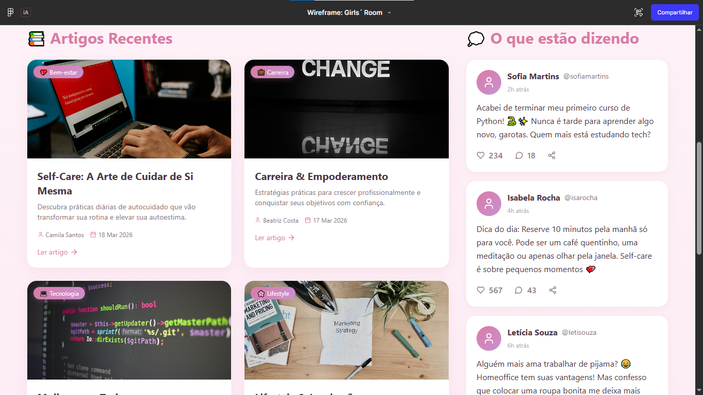
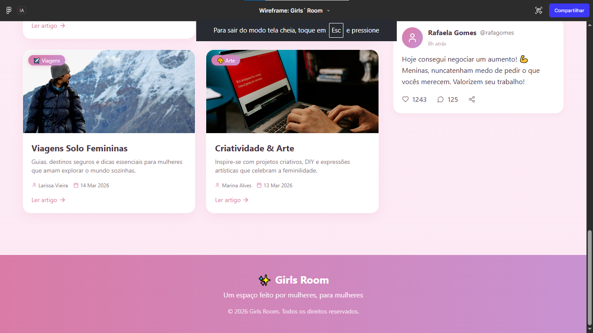
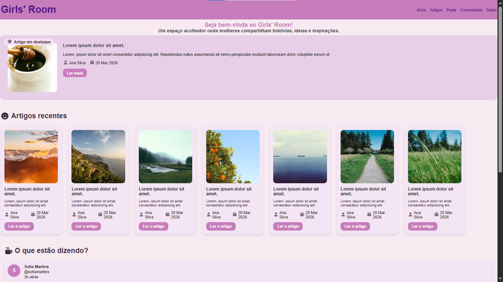
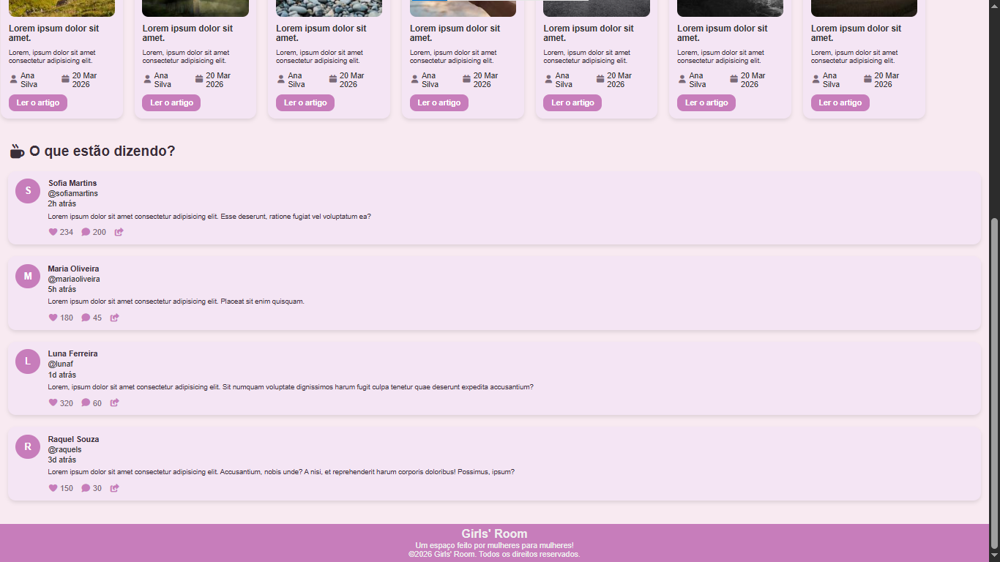

Atividade Prática - Semana 4

Informações Gerais
Nome: Maria Heloiza Amorim Xavier.
Matricula: 926696.
Proposta de projeto escolhida: 
Breve descrição sobre seu projeto: 

Foto do wireframe (feito pelo figma):

Foto da vizualização Web do projeto em html e css:

